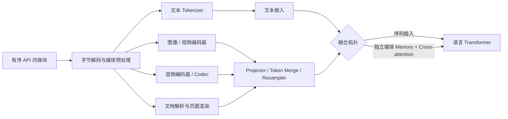

# 多模态大模型输入机制：从媒体字节到注意力计算

## 0. 阅读地图与符号约定

多模态输入不是一次简单的“文件 Token 化”，而是一组分层变换：

$$
\text{API 内容块}
\rightarrow \text{字节解码与媒体预处理}
\rightarrow \text{模态编码器}
\rightarrow \text{连接器/重采样器}
\rightarrow \text{排列与融合}
\rightarrow \text{语言模型}
$$

每一层解决的问题不同：API 层负责表达用户意图，预处理层负责控制可见信息，编码器提取模态特征，连接器对齐特征空间，融合层决定不同内容如何参与注意力计算。



本文采用以下矩阵约定：**每一行是一个序列位置，每一列是一个特征维度**。

| 符号                                  | 含义                         |
| ------------------------------------- | ---------------------------- |
| $H,W,C$                               | 图像高度、宽度与通道数       |
| $P$                                   | 正方形图像 Patch 的边长      |
| $F$                                   | 采样后的视频帧数             |
| $L_t,L_m$                             | 文本与媒体序列长度           |
| $d_v,d_a,d_l$                         | 视觉、音频和语言模型隐藏维度 |
| $Z_v \in \mathbb{R}^{L_v \times d_v}$ | 视觉编码器输出               |
| $H_l \in \mathbb{R}^{L_t \times d_l}$ | 语言模型隐藏状态             |

### 0.1“Token”的四种含义

多模态系统中至少有四种不同的 Token：

1. **文本 Token**：分词器产生的离散词表 ID，例如 $i_k \in \{0,\ldots，|V|-1\}$。
2. **媒体 Token/latent**：图像、音频或视频编码器产生的一个连续特征向量，通常没有文本词表 ID。
3. **序列位置**：参加 self-attention 或 cross-attention 的一行向量。
4. **计量 Token**：API 用于上下文限制、速率限制或计费的单位。它可能基于 Patch、Tile 或时长换算，不一定等于内部序列位置。

因此，“一张图用了 1000 Token”只在给定 provider、model 和 detail 设置后才有明确含义。它不能直接说明模型内部恰好存在 1000 个视觉向量，更不能说明这些向量来自文本词表。

### 0.2 公开架构与闭源服务的边界

开源模型和论文可以用于理解**可能的实现族**；商业 API 通常只公开请求格式、限制和计量规则。线上服务还可能执行缩放、切片、转码、安全过滤、OCR、抽帧和特殊元数据注入。除非厂商明确披露，API 行为不能唯一反推出模型内部架构。

---

## 1. 从 API 内容块到媒体张量

### 1.1 Base64、URL 和 File ID 只是传输方式

下面几种写法可以指向同一张图片：

- Base64 data URL；
- HTTPS URL；
- 预先上传后得到的 File ID；
- SDK 中的字节数组或文件对象。

它们的差异主要在网络传输、权限、生命周期和 Payload 大小。Base64 字符串不会作为数百万个文本字符交给视觉模型；服务会先解码出媒体字节，再按 MIME 类型进入图像解码器。类似地，File ID 可以避免重复上传字节，但不会自动消除媒体的上下文占用或推理成本。

可以把服务入口抽象为：

$$
b_i = (\text{type}_i,\text{source}_i,\text{metadata}_i,\text{position}_i)
$$

其中 $b_i$ 是第 $i$ 个有序内容块。`position` 表示应用层逻辑顺序，不代表内部 Token 的精确偏移。

### 1.2 解码与规范化会改变模型真正看到的内容

以图像为例，JPEG/PNG 字节先被解码为像素张量：

$$
I_{\mathrm{raw}} \in \{0,\ldots,255\}^{H \times W \times C}
$$

随后可能进行颜色空间转换、EXIF 方向修正、缩放、裁剪和归一化：

$$
I_{h,w,c} = \frac{I_{\mathrm{raw},h,w,c}/255 - \mu_c}{\sigma_c}
$$

所以模型坐标系通常对应**预处理后的图像**，未必对应原文件坐标。若原图按比例 $s$ 缩放并增加边缘填充 $(\Delta_x,\Delta_y)$，原坐标到模型坐标的近似映射是：

$$
(x',y') = (s x + \Delta_x,\; s y + \Delta_y)
$$

目标检测或 GUI 点击任务必须保存这条几何变换，才能把模型输出映射回原图。

### 1.3 内容块顺序是逻辑契约，不是内部布局保证

若 API 输入为：

$$
\mathcal{B} = [b_1^{\text{text}},b_2^{\text{image}},b_3^{\text{text}}]
$$

服务通常保留“文本、图片、文本”的提示语义，但可以把图片扩展成多个 Tile、加入媒体边界标记，或把视觉特征放入独立的 cross-attention memory。因此应用可以依赖**内容块的相对语义顺序**，但不应依赖某个未公开的内部 Token 索引。

---

## 2. 图像如何变成视觉特征序列

### 2.1 缩放、固定分辨率与动态分辨率

固定分辨率模型常把图像缩放到 $H_0 \times W_0$。这样序列长度固定、批处理简单，但有两个代价：

- 改变宽高比会扭曲形状；
- 将大图压小会丢失小字、细线和局部结构。

保持宽高比的系统常采用 letterbox、中心裁剪或 Tile。动态分辨率系统则允许不同图片产生不同数量的视觉位置。例如 Qwen2-VL 的公开架构根据原始尺寸产生可变数量的视觉 Token，并用最大像素/Token 预算限制显存。

一个常见的 Tile 策略可以表示为：

$$
I \rightarrow [I_{\mathrm{global}},I_1^{\mathrm{tile}},\ldots,I_K^{\mathrm{tile}}]
$$

全局缩略图提供整体构图，局部 Tile 保留细节。代价是重叠区域被重复编码，而且模型必须知道每个 Tile 对应原图的哪个区域。

### 2.2 Patchification

[Vision Transformer (ViT)](https://arxiv.org/abs/2010.11929) 的基本构造是把图像划分为 $P \times P$ 的非重叠 Patch。若 $H,W$ 都能被 $P$ 整除，则 Patch 数为：

$$
N = \frac{H}{P}\frac{W}{P}
$$

更一般地，加入边界填充后：

$$
N = \left\lceil\frac{H}{P}\right\rceil
    \left\lceil\frac{W}{P}\right\rceil
$$

把每个 Patch 展平，得到：

$$
X_p \in \mathbb{R}^{N \times (P^2C)}
$$

再通过可训练线性映射投影到视觉隐藏维度：

$$
Z_v^{(0)} = X_pW_p + \mathbf{1}b_p^\top + P_{\mathrm{pos}},
\qquad
W_p \in \mathbb{R}^{P^2C \times d_v}
$$

这个操作也可以用 `kernel_size=P, stride=P` 的二维卷积实现。卷积输出的空间网格展平后与 Patch 线性投影等价。

以 $224 \times 224$、$P=16$ 为例，$N=14^2=196$。这只是 ViT 的一个具体配置。线上服务可能使用不同 Patch、先做 Tile，或者在视觉编码器之后再次压缩序列。

### 2.3 视觉编码器内部的 self-attention

对输入 $Z \in \mathbb{R}^{N \times d_v}$，单个注意力头计算：

$$
Q=ZW_Q,\qquad K=ZW_K,\qquad V=ZW_V
$$

$$
\operatorname{Attn}(Z)
=\operatorname{softmax}\left(\frac{QK^\top}{\sqrt{d_h}}+B\right)V
$$

$B$ 可以包含位置偏置或 mask。矩阵 $QK^\top \in \mathbb{R}^{N \times N}$ 让每个 Patch 聚合其他 Patch 的信息。经过多层视觉 Transformer 后，每一行不再只描述原始局部像素，而是带有全图上下文的视觉表示。

需要区分两件事：

- **Patch 的来源位置**仍可追踪到二维网格；
- **编码后的向量内容**已经通过全局注意力混合，不再是某一小块像素的无损副本。

### 2.4 二维位置信息

把二维网格展平成一维序列会丢失显式行列结构，因此模型需要位置机制。常见方案包括：

- 可学习绝对位置嵌入；
- 二维正弦/余弦位置编码；
- 相对位置偏置；
- 2D RoPE；
- 把行、列位置拆成独立分量。

原始 ViT 使用可学习的一维位置嵌入，但这些向量在训练中可以学出行列拓扑。动态分辨率模型更常采用可外推或可插值的位置机制，因为 $N$ 和网格形状会随输入改变。

### 2.5 从视觉维度对齐到语言维度

视觉编码器输出通常是：

$$
Z_v \in \mathbb{R}^{N \times d_v}
$$

语言模型需要的输入维度为 $d_l$。最简单的连接器是线性投影：

$$
H_v = Z_vW_c+b_c,
\qquad
W_c \in \mathbb{R}^{d_v \times d_l}
$$

这里 $H_v \in \mathbb{R}^{N \times d_l}$ 已经与文本嵌入同维，可以作为一组“软视觉 Token”插入语言模型序列。[LLaVA](https://arxiv.org/abs/2304.08485) 的早期公开实现就是这一类视觉特征到词嵌入空间的轻量投影。

更一般的连接器可以是两层 MLP：

$$
H_v = \phi(Z_vW_1+b_1)W_2+b_2
$$

MLP 提供非线性对齐能力，但若逐位置独立应用，它并不减少序列长度 $N$。

### 2.6 Token 合并与固定长度重采样

高分辨率导致 $N$ 很大。连接器可以在进入 LLM 前压缩视觉序列。

**局部合并**把相邻 $r \times r$ 特征拼接或池化，再投影成一个向量：

$$
N' \approx \frac{N}{r^2}
$$

它保留规则网格结构，但会牺牲空间分辨率。

**Attention Resampler**使用 $M$ 个可学习查询，其中 $M$ 固定且通常远小于 $N$：

$$
Q_0 \in \mathbb{R}^{M \times d_q}
$$

$$
Q_1 = Q_0 +
\operatorname{softmax}\left(
\frac{(Q_0W_Q)(Z_vW_K)^\top}{\sqrt{d_h}}
\right)(Z_vW_V)
$$

输出长度由查询数 $M$ 决定，而不由原图 Patch 数直接决定。[Flamingo](https://arxiv.org/abs/2204.14198) 使用 Perceiver Resampler，[BLIP-2](https://arxiv.org/abs/2301.12597) 使用带可学习查询的 Q-Former。BLIP-2 的公开配置示例用 32 个查询，把更长的视觉特征压缩成固定数量的语言相关表示。

不同连接方式的核心权衡如下：

| 连接方式                    |   输出长度 | 主要优点                     | 主要损失/代价                 |
| --------------------------- | ---------: | ---------------------------- | ----------------------------- |
| 逐位置 Linear/MLP           |        $N$ | 保留完整空间网格             | LLM 序列长                    |
| Pooling/邻域合并            |    $N/r^2$ | 规则、便宜                   | 小目标和细节损失              |
| Learned Resampler/Q-Former  |   固定 $M$ | 成本与输入分辨率解耦         | 信息瓶颈，查询需要训练        |
| 独立 cross-attention memory | 可保留 $N$ | 不占文本 self-attention 序列 | 每层增加 cross-attention 成本 |

---

## 3. 音频如何变成时序特征

### 3.1 波形与采样

数字音频是离散波形：

$$
x[n],\qquad n=0,1,\ldots,Tf_s-1
$$

$f_s$ 是采样率，$T$ 是秒数。立体声可能先混合为单声道，音频也可能重采样到模型要求的 $f_s$。这些操作会影响高频信息、声道空间信息和时长对齐。

### 3.2 STFT 与 log-Mel 声谱图

一类常见音频编码器先计算短时傅里叶变换（STFT）。设窗长为 $N_w$、帧移为 $R$、窗函数为 $w[n]$：

$$
X_{m,k}
=\sum_{n=0}^{N_w-1}
x[n+mR]w[n]e^{-j2\pi kn/N_{\mathrm{FFT}}}
$$

$m$ 是时间帧，$k$ 是频率 bin。功率谱为 $|X_{m,k}|^2$。再用 Mel 滤波器组 $F_{b,k}$ 聚合频率并取对数：

$$
A_{m,b}
=\log\left(\epsilon+sum_k F_{b,k}|X_{m,k}|^2\right)
$$

得到：

$$
A \in \mathbb{R}^{N_{\mathrm{frame}} \times N_{\mathrm{mel}}}
$$

其中帧数近似为：

$$
N_{\mathrm{frame}} \approx \left\lfloor\frac{Tf_s-N_w}{R}\right\rfloor+1
$$

[Whisper](https://arxiv.org/abs/2212.04356) 属于 log-Mel 特征加音频 Transformer 编码器的公开例子。卷积 stride 或 pooling 会继续降低时间分辨率，使最终音频 latent 数少于原始声谱帧数。

### 3.3 连续音频特征与离散 Codec Token

另一类系统直接用卷积编码器处理波形，得到连续 latent：

$$
Z_a=E_a(x)\in\mathbb{R}^{L_a\times d_a}
$$

也可以使用神经音频 Codec，把连续 latent 量化为离散码。对码本 $\{e_1,\ldots,e_K\}$：

$$
k^*=\arg\min_k\|z-e_k\|_2^2
$$

Residual Vector Quantization（RVQ）会用多个码本逐级量化残差。[SoundStream](https://arxiv.org/abs/2107.03312) 是这种全卷积编码器、解码器与残差向量量化器联合训练的公开例子。

这里的离散音频码虽然也可称为 Token，但它属于**音频码本**，不等于文本词表 Token。模型可以为不同码本使用独立嵌入表，也可以把连续音频特征投影到 $d_l$ 后与文本融合。

### 3.4 时间位置与真实时间戳

音频序列顺序本身提供相对时间：第 $m$ 帧大约对应 $t_m=mR/f_s$。模型可以使用绝对位置、相对位置、RoPE、卷积感受野或分块位置编码理解先后关系，并不要求把每个秒数单独通过 MLP 映射。

需要区分：

- **内部位置**：第几个音频 latent，用于模型计算；
- **墙钟时间**：例如 `02:31.5`，用于用户查询和结果定位；
- **容器时间戳**：流媒体的 presentation timestamp，用于音画同步。

服务可以显式注入墙钟时间戳，也可以只保留顺序，让模型从采样率换算。API 能返回时间定位并不意味着内部必然采用某一种时间嵌入。

### 3.5 流式音频的分块

实时系统把波形切成 chunk：

$$
x=[x^{(1)},x^{(2)},\ldots,x^{(J)}]
$$

chunk 太短会缺少语音上下文，太长会增加首字延迟。相邻 chunk 常保留 overlap，编码器也可能维护卷积状态或 KV Cache。工程上必须同时记录：

- chunk 的绝对起止时间；
- 重叠区间；
- 是否发生丢包或重采样；
- 多声道到单声道的变换。

否则模型输出即使语义正确，也可能无法可靠映射回原音频时间线。

---

## 4. 视频：空间与时间共同决定序列结构

### 4.1 抽帧后的基本张量

视频解码并采样后可写成：

$$
V\in\mathbb{R}^{F\times H\times W\times C}
$$

其中第 $f$ 帧对应真实时间 $t_f$。若以固定采样率 $r$ FPS 采样，则 $t_f\approx f/r$；变帧率视频必须依据容器时间戳，不能只按帧号换算。

最直接的方案是逐帧做图像 Patch 编码。每帧有 $S$ 个空间 Patch 时，视觉序列长度近似为：

$$
L_v=FS
$$

### 4.2 Tubelet

视频 Transformer 也可以一次处理连续 $\tau$ 帧的 $P\times P$ 空间块，即 tubelet。每个 tubelet 展平维度为 $\tau P^2C$，序列长度约为：

$$
L_v=
\left\lceil\frac{F}{\tau}\right\rceil
\left\lceil\frac{H}{P}\right\rceil
\left\lceil\frac{W}{P}\right\rceil
$$

$\tau$ 越大，序列越短，但短暂动作会在时间下采样中被压缩。Qwen2-VL 的公开架构就是用 3D 卷积处理时间深度为 2 的视觉 tube。

### 4.3 全时空注意力与分解注意力

若对全部 $FS$ 个位置做全局 self-attention，注意力矩阵大小为 $(FS)\times(FS)$，复杂度近似：

$$
O(F^2S^2d)
$$

一种降低成本的方法是先在每帧内做空间注意力，再对同一空间位置做时间注意力：

$$
O(FS^2d)+O(SF^2d)
$$

这类 factorized space-time attention 减少了计算，但也改变了跨时空信息交互路径。另一种方法是先提取每帧特征，再用 temporal pooling/resampler 压缩成固定数量的视频 latent。

### 4.4 三轴位置与 M-RoPE

视频位置自然包含 $(t,h,w)$ 三个坐标。RoPE 对查询和键向量的二维子空间施加随位置变化的旋转。对一个二维向量分量，可写成：

$$
R(\theta_p)=
\begin{bmatrix}
\cos\theta_p&-\sin\theta_p\\
\sin\theta_p&\cos\theta_p
\end{bmatrix}
$$

$$
q_p'=R(\theta_p)q_p,\qquad k_s'=R(\theta_s)k_s
$$

由于 $R(\theta_p)^\top R(\theta_s)=R(\theta_s-\theta_p)$，点积可以表达相对位移。多轴 RoPE 可把通道分组，分别使用 $t,h,w$ 的位置 ID。Qwen2-VL 的 M-RoPE 是一个公开例子：

- 文本三个轴使用相同 ID，退化为 1D 位置；
- 图像固定时间 ID，行列 ID 分别变化；
- 视频时间、行、列 ID 都可变化。

这是一种具体实现，不是所有商业 LMM 的统一位置机制。

### 4.5 音轨、字幕和时间线对齐

视频通常还有音轨 $A(t)$、字幕区间 $S_j=[t_j^{\mathrm{start}},t_j^{\mathrm{end}}]$ 和帧时间戳。一个统一事件可以写成：

$$
e_j=(t_j^{\mathrm{start}},t_j^{\mathrm{end}},
\text{visual}_j,\text{audio}_j,\text{text}_j)
$$

融合系统可能把这些内容按时间交错，也可能分别编码后通过共享时间位置或 cross-attention 对齐。采样率不同时，不需要强行让音频和视频拥有同样数量的 Token；只需要位置机制和训练目标能够建立对应关系。

### 4.6 抽帧是信息瓶颈

采样率 $r$ 意味着采样间隔为 $1/r$ 秒。持续时间小于该间隔的事件可能完全落在两帧之间。提高分辨率只改善单帧细节，不能弥补时间采样缺失；提高 FPS 只改善时间分辨率，也不能恢复已经缩小到不可读的文字。

因此视频质量预算至少有两个独立轴：

$$
\text{空间分辨率}\quad\text{与}\quad\text{时间分辨率}
$$

---

## 5. PDF 与文档：文本通道和视觉通道

### 5.1 PDF 不是纯文本容器

PDF 页面可以同时包含：

- 字符及其坐标；
- 扫描图像；
- 矢量图形；
- 表格线、公式和多栏布局；
- 页眉、页脚、脚注和阅读顺序。

只抽取字符会丢失版面和图表；只把页面渲染成图像又会增加视觉 Token，并可能降低小字识别精度。因此视觉 PDF 服务常采用双通道：

$$
\text{PDF page}
\rightarrow
(\text{extracted text},\text{rendered page image})
$$

OpenAI 当前文件输入文档明确说明，视觉模型处理 PDF 时会同时获得抽取文本和页面图像。Anthropic 的 PDF 文档块也以文字、图片、图表和版面理解为目标。

### 5.2 页面排列与锚点

一种概念性布局是：

```text
<PAGE 1>
  <PAGE_TEXT> ... </PAGE_TEXT>
  <PAGE_IMAGE> ...visual latents... </PAGE_IMAGE>
<PAGE 2>
  ...
<QUESTION> ... </QUESTION>
```

真实服务未必采用这个精确序列，但页码、区域坐标和内容类型需要以某种形式保留，否则模型无法稳定回答“第 7 页右上图表”之类的问题。

双通道还会产生重复：图片中的文字可能同时出现在 extracted text、OCR 结果和页面视觉特征中。重复不一定有害，但会消耗上下文，也可能在两条通道识别不一致时产生冲突。

### 5.3 表格和电子表格

表格既有值，也有二维关系。简单地按行转成文本：

$$
[(r_1,c_1,v_{11}),\ldots,(r_i,c_j,v_{ij})]
$$

适合精确计算和检索；页面图像适合识别合并单元格、颜色编码、图表与视觉分组。生产系统通常根据任务组合结构化解析、代码执行和视觉理解，而不是把所有表格都作为截图处理。

---

## 6. 排列、拼接与融合

这是多模态输入机制的核心。关键问题不是“媒体是否变成 Token”，而是媒体表示在什么轴上加入、使用什么位置和 mask，以及哪些层能访问它们。

### 6.1 沿序列轴拼接

设文本嵌入：

$$
T\in\mathbb{R}^{L_t\times d_l}
$$

投影后的图像特征：

$$
H_v\in\mathbb{R}^{L_v\times d_l}
$$

沿序列轴拼接得到：

$$
X=[T;H_v]_{\mathrm{seq}}
\in\mathbb{R}^{(L_t+L_v)\times d_l}
$$

实际交错输入可能概念性地展开为：

```text
<BOS>
“图 A：”
<IMAGE_START> h_1 ... h_Lv <IMAGE_END>
“图 B：”
<IMAGE_START> g_1 ... g_Lv <IMAGE_END>
“比较图 A 和图 B。”
```

媒体边界标记告诉模型哪些连续位置属于同一媒体块。图像标签“图 A”“图 B”则提供稳定的语言指针。

### 6.2 沿特征轴拼接

若两个张量具有相同序列长度：

$$
A\in\mathbb{R}^{L\times d_1},\qquad
B\in\mathbb{R}^{L\times d_2}
$$

沿特征轴拼接为：

$$
[A\|B]_{\mathrm{feat}}
\in\mathbb{R}^{L\times(d_1+d_2)}
$$

它不会改变 $L$，因此不会仅因为拼接就把注意力矩阵从 $L\times L$ 变成 $2L\times2L$。它增加的是 Q/K/V 投影和 MLP 的特征维计算量。模型通常再用矩阵 $W\in\mathbb{R}^{(d_1+d_2)\times d_l}$ 投影回固定隐藏宽度。

这两种“拼接”必须严格区分：

| 操作     | 张量形状变化        | 对 self-attention 的直接影响 |
| -------- | ------------------- | ---------------------------- |
| 序列拼接 | $L_1+L_2$，宽度不变 | 注意力矩阵边长增加           |
| 特征拼接 | $L$ 不变，宽度增加  | Q/K/V 和 MLP 更宽            |

### 6.3 Decoder-only 模型中的 causal mask

标准缩放点积注意力写成：

$$
\operatorname{Attn}(Q,K,V)
=\operatorname{softmax}\left(
\frac{QK^\top}{\sqrt{d_h}}+M+B
\right)V
$$

其中 causal mask：

$$
M_{ij}=
\begin{cases}
0,&j\le i\\
-\infty,&j>i
\end{cases}
$$

若媒体 latent 放在问题和答案之前，后续答案位置可以注意到全部先前媒体位置。媒体 latent 在语言模型内部可能仍受 causal mask，但它们进入 LLM 前通常已经通过双向视觉/音频编码器获得模态内上下文。有些架构也会为媒体区间使用专门的双向或 block mask。

### 6.4 Cross-attention：媒体作为独立记忆

另一类架构不把全部媒体 latent 塞进文本 self-attention 序列，而是在语言层加入 cross-attention：

$$
Q=H_lW_Q,\qquad K=Z_mW_K,\qquad V=Z_mW_V
$$

$$
\operatorname{CrossAttn}(H_l,Z_m)
=\operatorname{softmax}\left(
\frac{QK^\top}{\sqrt{d_h}}+M_{tm}
\right)V
$$

$$
H_l' = H_l + \gamma_l\operatorname{CrossAttn}(H_l,Z_m)
$$

$Z_m\in\mathbb{R}^{L_m\times d_m}$ 是独立媒体 memory，$M_{tm}$ 决定每个文本位置可以访问哪些媒体。$\gamma_l$ 可以是可训练门控。Flamingo 使用插入语言模型层的 gated cross-attention，并为交错图文设计媒体可见性规则。

这时文本 self-attention 复杂度仍约为 $O(L_t^2d)$，额外 cross-attention 复杂度约为：

$$
O(L_tL_md)
$$

若先用 resampler 把 $L_m$ 压到固定 $M$，则该项变成 $O(L_tMd)$。

### 6.5 混合架构

实际模型可以混合使用：

- Q-Former/resampler 先把图像压成固定 latent；
- 再把这些 latent 作为软前缀沿序列轴插入；
- 或者在若干语言层通过 cross-attention 读取；
- 文本、图像、音频可以采用不同连接器。

“原生端到端”描述训练和产品能力，不限定必须使用早期拼接、共享编码器或某一种注意力拓扑。

### 6.6 位置、边界和模态身份

排列后每个位置至少需要表达三类信息：

$$
\text{内容} + \text{位置} + \text{模态/边界}
$$

这些信息不一定通过简单向量相加实现，也可以进入 RoPE、attention bias、special token 或独立 mask。典型组成包括：

- 文本的一维顺序；
- 图像内部的 $(h,w)$；
- 视频内部的 $(t,h,w)$；
- 音频的帧位置或真实时间；
- 媒体块在整段对话中的先后；
- `<IMAGE_START>`、`<IMAGE_END>`、页码或媒体 ID。

二维媒体展平为一维后，**序列索引**和**空间坐标**可以同时存在。例如第 420 个序列位置可以携带“图 B 的第 3 行第 7 列 Patch”这一结构信息。

### 6.7 为什么内容顺序会影响结果

标准 attention 的 $QK^\top$ 并没有“物理距离越近权重必然越大”的数学定律。顺序效应主要来自：

1. 位置编码或相对位置偏置；
2. causal mask 决定可见方向；
3. 训练数据中常见的图文排列模式；
4. 上下文很长时的检索与注意力退化；
5. 媒体可见性 mask，例如只允许文本访问最近的先前媒体；
6. “这张图”“前一页”之类自然语言指代本身的歧义。

厂商建议也可能不同。Anthropic 当前一般建议图片在前、查询在后；Gemini 当前建议单图任务把提示文本放在图片前，而单视频任务把提示放在视频后。应用应保留逻辑顺序、显式标记媒体，并对目标模型做顺序消融实验。

多图任务推荐：

```text
图 A（生产环境拓扑）：<image A>
图 B（灾备环境拓扑）：<image B>

分别引用图 A 和图 B，比较入口、状态存储和故障域。
```

稳定标签比“上图”“第二张”更适合多轮对话、上下文裁剪和请求重放。

### 6.8 一个完整的序列长度例子

考虑一张 $768\times1024$ 的 RGB 图片，采用 $P=16$ 的非重叠 Patch。空间网格为：

$$
\frac{768}{16}\times\frac{1024}{16}=48\times64
$$

因此视觉编码器产生 $N=3072$ 个网格位置。假设视觉维度 $d_v=1024$，语言维度 $d_l=4096$：

$$
Z_v\in\mathbb{R}^{3072\times1024}
\xrightarrow{W_c}
H_v\in\mathbb{R}^{3072\times4096}
$$

投影改变特征宽度，不改变序列长度。若做 $2\times2$ 邻域合并，网格变成：

$$
24\times32=768
$$

若使用固定 $M=64$ 的 resampler，则进入语言侧的视觉长度变为 64。设文本长度为 400，忽略少量边界标记，则三种 early-fusion 序列长度分别为：

| 连接方式           | 总长度 $L$ | self-attention 矩阵元素数 $L^2$ | 相对纯文本 $400^2$ |
| ------------------ | ---------: | ------------------------------: | -----------------: |
| 不压缩 Patch       |       3472 |                      12,054,784 |         约 75.3 倍 |
| $2\times2$ 合并    |       1168 |                       1,364,224 |          约 8.5 倍 |
| 64-query resampler |        464 |                         215,296 |         约 1.35 倍 |

这个例子只说明架构层面的序列规模，不代表任何商业 API 的内部 Token 数或价格。它揭示了连接器的核心作用：不仅对齐 $d_v$ 与 $d_l$，还可以决定语言模型需要直接处理多少个媒体位置。

---

## 7. 模型如何学会跨模态对齐

排列和连接器只提供信息通道；模型还需要训练目标来学会哪些视觉/音频特征对应哪些语言概念。

### 7.1 对比学习

[CLIP](https://arxiv.org/abs/2103.00020) 一类模型把配对图像和文本编码为全局向量 $v_i,t_i$，最大化正确配对的相似度。单向 image-to-text loss 可写为：

$$
\mathcal{L}_{i\rightarrow t}
=-\frac{1}{B}\sum_{i=1}^B
\log
\frac{\exp(\operatorname{sim}(v_i,t_i)/\tau)}
{\sum_{j=1}^B\exp(\operatorname{sim}(v_i,t_j)/\tau)}
$$

通常还加上对称的 text-to-image loss。它让两种模态的全局语义接近，适合检索和作为视觉编码器预训练，但仅靠全局对比不一定足以学习细粒度空间指代。

### 7.2 条件语言建模

给定媒体 $m$、指令 $x$ 和目标答案 $y=(y_1,\ldots,y_T)$：

$$
p(y\mid x,m)
=\prod_{t=1}^T
p(y_t\mid y_{<t},x,m)
$$

训练损失为：

$$
\mathcal{L}_{\mathrm{LM}}
=-\sum_{t=1}^T
\log p(y_t\mid y_{<t},x,m)
$$

梯度会训练连接器、cross-attention 和被解冻的编码器/LLM 参数，使答案 Token 能从相关媒体特征中取得信息。

### 7.3 匹配、定位与指令微调

模型还可联合使用：

- image-text matching；
- captioning/VQA；
- OCR 和文档问答；
- bounding box、point、segmentation 等 grounding 目标；
- 带时间戳的音频/视频问答；
- 多轮多图 instruction tuning。

这些训练分布决定了模型对内容块顺序、媒体标签和坐标格式的熟悉程度。注意力权重是内部计算的一部分，但不能直接当作因果解释或可靠的对齐证明。

### 7.4 冻结模块与分阶段训练

常见训练策略是先冻结大型视觉编码器和 LLM，只训练连接器；再根据数据量与稳定性解冻部分或全部模块。BLIP-2 先训练 Q-Former 做视觉语言表示学习，再把其输出投影为 LLM 可解释的软视觉提示。LLaVA 则先训练视觉投影，再做视觉指令微调。

这解释了“连接器”为什么不是纯格式转换：它是通过数据学习出来的跨模态统计映射。

---

## 8. Agent 中的内容表示与 Provider 序列化

### 8.1 Markdown 不是通用附件协议

模型可以把 Markdown 当作文本，也可以通过文件接口读取 `.md` 文件。但下面的 Markdown：

```markdown

```

通常只产生 alt 文本和路径字符串。模型 API 是否真的读取 `./arch.png`，取决于 UI 或 Agent Harness 是否把它解析成显式附件。应用不应把 Markdown 渲染行为等同于模型 API 行为。

### 8.2 建立 Provider 无关的有序 IR

推荐先构造应用自己的中间表示：

```typescript
type ContentPart =
  | { kind: "text"; text: string }
  | { kind: "image"; id: string; source: MediaSource; detail?: string }
  | { kind: "audio"; id: string; source: MediaSource; timeRange?: [number, number] }
  | { kind: "video"; id: string; source: MediaSource; timeRange?: [number, number] }
  | { kind: "document"; id: string; source: MediaSource; pages?: number[] };
```

有序 IR 应保存：

- 稳定媒体 ID；
- 用户给出的逻辑位置；
- 原始来源与哈希；
- MIME、尺寸、时长、页数；
- 缩放、裁剪、FPS、时间区间等预处理记录；
- 用户授权与数据保留策略。

### 8.3 并行准备与稳定顺序

上传、转码和元数据提取可以并行。`Promise.all` 本身按输入顺序返回结果，因此可以直接保持 IR 顺序：

```javascript
const prepared = await Promise.all(parts.map(preparePart));
```

不应在各异步任务完成时向同一个最终数组 `push`，因为完成顺序由网络和文件大小决定。若系统经过队列或分布式 Worker，应显式保存 `partIndex` 并在序列化前排序。

### 8.4 Provider Schema 不统一

| Provider/API        | 典型有序输入项                             | 重要边界                                                     |
| ------------------- | ------------------------------------------ | ------------------------------------------------------------ |
| OpenAI Responses    | `input_text`、`input_image`、`input_file`  | 当前音频聊天使用音频模型的 Chat Completions 或 Realtime 路径 |
| Anthropic Messages  | `text`、`image`、`document` content blocks | source 可以是 Base64、URL 或 File ID，具体能力依平台而异     |
| Gemini Interactions | `text`、`image`、`audio`、`video`          | 支持媒体分辨率与 Files API，模型能力依版本而异               |

OpenAI Responses 的图像输入示例：

```json
{
  "model": "<vision-capable-model>",
  "input": [
    {
      "role": "user",
      "content": [
        { "type": "input_text", "text": "图 A（生产拓扑）：" },
        {
          "type": "input_image",
          "image_url": "data:image/png;base64,...",
          "detail": "high"
        },
        { "type": "input_text", "text": "定位其中的共享故障域。" }
      ]
    }
  ]
}
```

适配层的职责是把内部 IR 映射到目标 Schema、验证 endpoint/model 的模态能力，并记录实际发送顺序。不要把某一厂商或某一 endpoint 的字段名当作跨厂商标准。

### 8.5 Markdown 媒体解析的安全边界

若产品明确允许 Markdown 引用成为附件，应使用 AST 解析器，并执行：

- 本地路径限制在授权工作区，解析符号链接和 `..` 路径穿越；
- 远程 URL 限制协议、重定向、私网地址和 DNS rebinding；
- 校验真实 MIME，不只信任扩展名；
- 限制下载大小、像素数、页数、时长和解压后大小；
- 对 SVG、HTML、PDF 和媒体容器采用对应的主动内容安全策略；
- 给每个解析出的媒体分配稳定 ID，而不是只依赖出现序号。

---

## 9. 上下文长度、计算复杂度与 API 计量

### 9.1 一个统一的预算模型

可以先用下式估计一次请求的上下文需求：

$$
L_{\mathrm{est}}
=L_{\mathrm{text}}
+\sum_i L_{\mathrm{image},i}
+r_aT_a
+r_vT_v
+L_{\mathrm{document}}
+L_{\mathrm{special}}
$$

$r_a,r_v$ 是目标服务公开或实测的每秒计量率。还要为输出、工具调用和后续轮次保留空间：

$$
L_{\mathrm{est}}+L_{\mathrm{reserve}}\le L_{\mathrm{context,max}}
$$

上传 File ID 只改变传输方式；文件被模型读取时，其文本、页面图像或媒体表示仍会进入这一预算。

### 9.2 self-attention 与 cross-attention 成本

标准全 self-attention 的主要注意力矩阵成本近似：

$$
O(L^2d)
$$

但完整 Transformer 还包括 Q/K/V 投影和 MLP，后者通常具有 $O(Ld^2)$ 成本。媒体序列变长会同时影响多个项。

若媒体保持为独立 memory：

$$
O(L_t^2d)+O(L_tL_md)
$$

这就是 resampler、Token merging 和 cross-attention 拓扑能够显著改变计算分配的原因。API 价格不必严格等于底层 FLOPs；厂商通常按输入/输出计量 Token 和产品规则定价。

### 9.3 当前公开的媒体计量例子

以下规则用于理解量级，不应当作永久常量：

| 服务           | 当前公开规则示例                                                                  | 控制项                                               |
| -------------- | --------------------------------------------------------------------------------- | ---------------------------------------------------- |
| OpenAI 图像    | 部分模型按 32x32 Patch 计量并应用模型倍率；GPT-4o 等使用 base + 512px Tile 规则   | `detail: low/high/original/auto`，支持范围依模型变化 |
| Anthropic 图像 | visual token 近似为 `ceil(W/28) * ceil(H/28)`，超过模型上限会缩小                 | 客户端预缩放；模型分辨率层级                         |
| Gemini 图像    | 两边不超过 384px 时为 258 Token；更大图像按 768x768 Tile 计量                     | `media_resolution`                                   |
| Gemini 音频    | 当前文档约 32 Token/秒，即每分钟约 1920 Token                                     | 截取区间、转录/摘要 Pipeline                         |
| Gemini 视频    | File API 当前默认约 1 FPS；默认媒体分辨率约 300 Token/秒，低分辨率约 100 Token/秒 | `media_resolution`、时长和相关片段                   |

按输入 Token 定价时，账单通常随**计量 Token 数近似线性**增加；Tile 阈值、最低收费和倍率会造成分段跳变。$O(L^2)$ 描述某类内部注意力计算，不等于 API 账单按上下文长度平方收费。

### 9.4 质量与成本是多维优化

图片至少有分辨率、压缩质量、裁剪范围三个控制轴；视频还增加 FPS 和时间区间；PDF 增加页数、渲染 DPI 和文本/视觉双通道；音频增加采样率、声道和 chunk 长度。

可以把工程目标写成受预算约束的优化：

$$
\max_{\theta_{\mathrm{prep}}}
\;\mathbb{E}[Q(\theta_{\mathrm{prep}})]
\quad
\text{s.t.}
\quad
C(\theta_{\mathrm{prep}})\le C_{\max},
\quad
D(\theta_{\mathrm{prep}})\le D_{\max}
$$

$Q$ 是任务质量，$C$ 是成本，$D$ 是延迟，$\theta_{\mathrm{prep}}$ 包含分辨率、FPS、页数和 detail 等参数。最优配置取决于任务：OCR 需要空间细节，动作识别需要时间分辨率，粗粒度分类可能只需低 detail。

---

## 10. 可复现实验与诊断方法

### 10.1 记录模型真正看到的输入

每次请求建议记录：

- provider、endpoint、model 和版本；
- 内容块的有序列表与稳定 ID；
- 实际发送的图片尺寸、页数、时长和 FPS；
- detail/media resolution；
- 文件哈希与预处理参数；
- Token 估算和返回的实际 `usage`；
- 延迟、成本和任务评分。

仅保存原始文件不足以复现，因为服务前的缩放、裁剪和抽帧可能已经改变输入。

### 10.2 顺序消融

对同一批样本测试：

1. image -> question；
2. question -> image；
3. label -> image -> question；
4. 所有图片在前、问题在后；
5. 图片与局部问题交错。

比较准确率、指代错误率、延迟和 Token 使用。不要只根据单个示例决定全局模板。

### 10.3 分辨率与采样消融

- 图片：low/high/original 或不同最大像素数；
- 视频：不同 FPS、不同时间裁剪和空间分辨率；
- PDF：纯文本、页面图像、双通道；
- 音频：完整音频、分段、先转录再问答、直接音频理解。

画出质量 - 成本 Pareto frontier，选择没有被其他配置同时在质量、成本和延迟上支配的点。

### 10.4 工程检查清单

- [ ] 明确区分内容块、内部 latent、序列位置和计量 Token。
- [ ] endpoint 与 model 明确支持所需输入/输出模态。
- [ ] 媒体边界和 ID 稳定，不依赖模糊序号。
- [ ] 预处理后的坐标、时间和页码可以映射回原媒体。
- [ ] 并行上传、队列和重试不会改变逻辑顺序。
- [ ] PDF 双通道的重复上下文和冲突已经评估。
- [ ] detail、media resolution、FPS、页数和时长有明确预算。
- [ ] 文件权限、生命周期、数据保留和删除策略符合要求。
- [ ] 估算 Token、实际 `usage`、质量和成本定期对账。

---

## 参考资料

### 基础与公开架构

- [Attention Is All You Need](https://arxiv.org/abs/1706.03762)
- [An Image is Worth 16x16 Words: Transformers for Image Recognition at Scale (ViT)](https://arxiv.org/abs/2010.11929)
- [Learning Transferable Visual Models From Natural Language Supervision (CLIP)](https://arxiv.org/abs/2103.00020)
- [Flamingo: a Visual Language Model for Few-Shot Learning](https://arxiv.org/abs/2204.14198)
- [BLIP-2: Bootstrapping Language-Image Pre-training with Frozen Image Encoders and Large Language Models](https://arxiv.org/abs/2301.12597)
- [Visual Instruction Tuning (LLaVA)](https://arxiv.org/abs/2304.08485)
- [Robust Speech Recognition via Large-Scale Weak Supervision (Whisper)](https://arxiv.org/abs/2212.04356)
- [SoundStream: An End-to-End Neural Audio Codec](https://arxiv.org/abs/2107.03312)
- [Is Space-Time Attention All You Need for Video Understanding?](https://arxiv.org/abs/2102.05095)
- [Qwen2-VL: Enhancing Vision-Language Model's Perception of the World at Any Resolution](https://arxiv.org/abs/2409.12191)
- [OpenAI: GPT-4o System Card](https://cdn.openai.com/gpt-4o-system-card.pdf)

### 厂商动态规则

- [OpenAI: Images and vision](https://developers.openai.com/api/docs/guides/images-vision)
- [OpenAI: Audio and speech](https://developers.openai.com/api/docs/guides/audio)
- [OpenAI: File inputs](https://developers.openai.com/api/docs/guides/file-inputs)
- [Anthropic: Vision](https://platform.claude.com/docs/en/build-with-claude/vision)
- [Anthropic: PDF support](https://platform.claude.com/docs/en/build-with-claude/pdf-support)
- [Gemini API: Image understanding](https://ai.google.dev/gemini-api/docs/image-understanding)
- [Gemini API: Audio understanding](https://ai.google.dev/gemini-api/docs/audio)
- [Gemini API: Video understanding](https://ai.google.dev/gemini-api/docs/video-understanding)

---

## 结语

理解多模态输入可以抓住四个问题：媒体如何变成张量，张量如何变成 latent，latent 如何排列或作为独立 memory 被读取，以及训练如何让这些表示与语言对齐。API 内容块规定逻辑结构，预处理决定模型能看见什么，连接器决定信息瓶颈，位置与 mask 决定可见关系，训练数据决定模型如何解释这种关系。把这些层分开分析，就能同时理解数学机制、上下文成本和 Agent 工程行为。
