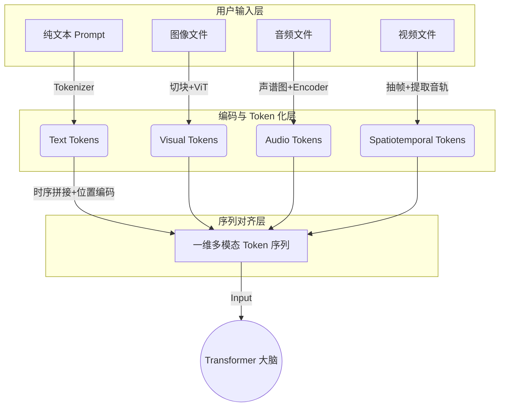

# 多模态大模型 (LMM) 输入处理机制深度解析：从用户态 Markdown 到底层 Token 的工程实践

## 概述

随着大语言模型从纯文本处理向多模态大模型（Large Multimodal Models, LMMs）演进，如何将复杂的非结构化多媒体数据（图像、音频、视频）结构化地输入给模型，成为了 AI 应用开发的核心课题。

本报告旨在系统性梳理多模态数据在 LMM 中的底层处理逻辑、Token 化映射机制，以及在 Agent 工程中从用户输入（如 Markdown）到标准 API Payload 的转换实践。

---

## 1. 架构演进：从 Pipeline 拼装到原生端到端 (Native E2E)

在处理多媒体输入时，当前的 AI 工业界主要存在两种架构范式：

### 1.1 传统中间转换架构 (Pipeline)

此架构依赖专门的单模态模型作为“前置翻译官”，将多媒体降维转化为纯文本，再输入给 LLM。

- **图像处理**：依赖 OCR 或 VQA 模型提取文本或生成画面描述。
- **音频处理**：依赖 ASR（如 Whisper）将语音转录为带时间戳的文本。
- **视频处理**：抽帧 + 图像描述 + 音频转录。
- **特点**：工程可控性高，Token 成本低；但存在严重的信息损耗（如丢失情绪语气、细微表情等环境信息）。

### 1.2 原生多模态架构 (Native End-to-End)

以 Gemini 1.5 Pro、GPT-4o 为代表的前沿模型，其底层 Transformer 架构原生支持多模态输入。模型不再需要前置的纯文本翻译，而是通过专属的编码器（Encoders）将原始多媒体数据直接映射为高维向量空间中的 Token。

---

## 2. 万物皆 Token：多模态数据的底层转换机制

在原生 LMM 的视角中，所有模态最终都必须被“降维”并统一为 Transformer 网络能够理解的同质化语言——**Token**。

### 2.1 图像 (Image) -> Visual Tokens

采用类似 Vision Transformer (ViT) 的机制：

1. **Patching**：将整张图像切分为固定尺寸的小方块（Patches，例如 16x16 像素）。
2. **Encoding**：每个 Patch 经过视觉编码器（Vision Encoder）处理，被压缩投射为一个特征向量。
3. **Tokenization**：这组一维排列的特征向量即构成 Visual Tokens。

### 2.2 音频 (Audio) -> Audio Tokens

音频波形无法直接处理，需经过频域转换：

1. **Spectrogram**：将一维的连续音频波形转换为二维的声谱图（包含频率、时间和强度）。
2. **Encoding**：将声谱图视作特殊“图像”，进行切块并输入音频编码器，转化为 Audio Tokens。

### 2.3 视频 (Video) -> Spatiotemporal Tokens

视频本质是时空数据的集合：

1. **抽帧 (Frame Extraction)**：按照特定采样率（FPS）提取关键帧图像，转化为一系列连续的 Visual Tokens。
2. **音轨分离**：提取音频转化为 Audio Tokens。
3. **时空编码注入**：为所有 Token 注入时间戳嵌入（Timestamp Embeddings）和位置编码，确保模型理解动作的时序逻辑。



---

## 3. 序列对齐与注意力机制：Markdown 排版的底层意义

Transformer 模型本质上是一个“线性阅读器”，它只能按照一维队列从前向后摄入 Token。

**核心结论：用户在前端 Markdown 中的排版顺序，直接决定了底层 Token 序列的物理排列顺序。**

- **注意力距离（Attention Distance）**：LMM 的自注意力机制（Self-Attention）在计算 Token 关联时，物理距离越近的 Token 越容易建立强关联。
- **就近原则映射**：在 Markdown 中将文本指令紧挨着 `` 或 `<video>` 占位符放置，在底层即表现为 Text Tokens 与 Visual Tokens 在输入序列中的相邻，这极大地降低了模型产生“幻觉”或指代不清的概率。

---

## 4. Agent 工程边界：从 Markdown 到结构化 Payload

在大模型工程实践中，**LMM 的 API 接口并不解析 Markdown 的渲染逻辑**。Markdown 仅仅是面向人类的 UI（User Interface）糖。Agent/中间件工程的核心职责是将用户的非结构化混排输入，解构并重新拼装为严格的 JSON Payload。

### 4.1 工业标准输入格式：Multi-part Array

前沿模型的 API 标准已高度统一，均采用明确声明媒体类型的数组结构（交错式输入）。

**用户侧 Markdown 输入示例：**

```markdown
请对比这两张架构图的差异：

结合上述结构，指出  中的单点故障。
```

**Agent 工程转化后的标准 API Payload (JSON)：**

```json
{
  "messages": [
    {
      "role": "user",
      "content": [
        { "type": "text", "text": "请对比这两张架构图的差异：\n" },
        { "type": "image_url", "image_url": { "url": "内部存储 URI 或 Base64 数据_1" } },
        { "type": "text", "text": "\n结合上述结构，指出 " },
        { "type": "image_url", "image_url": { "url": "内部存储 URI 或 Base64 数据_2" } },
        { "type": "text", "text": " 中的单点故障。" }
      ]
    }
  ]
}
```

### 4.2 Agent 核心处理流

在实际工程中，处理多媒体输入的标准化流程如下：

1. **解析 (Parse)**：利用 AST（抽象语法树）解析 Markdown，识别多媒体标签（如图片链接、自定义的 `<audio_1>` 等）。
2. **提取与上传 (Extract & Upload)**：将媒体文件从文本中剥离，调用 LMM 的 File API 或对象存储，换取模型可读的系统内 URI。
3. **序列化拼装 (Assemble)**：严格按照 Markdown 原有的时序逻辑，将文本分段与多媒体 URI 封装成多模态 JSON 数组（如上述示例），最终提交给大模型推理。

## 结语

理解多模态大模型的输入处理机制，核心在于跨越“用户视角的排版表现”与“模型视角的数学本质”之间的鸿沟。在未来的 AI Agent 开发中，遵循底层 Token 序列的对齐逻辑，并构建稳健的 Markdown 到 JSON Payload 转换管线，是保障复杂多模态应用稳定性和准确率的工程基石。
